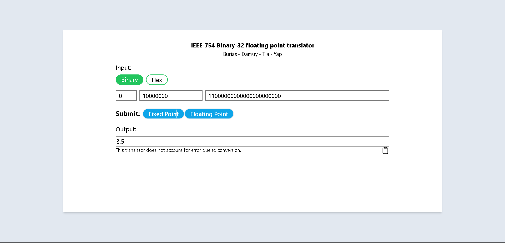
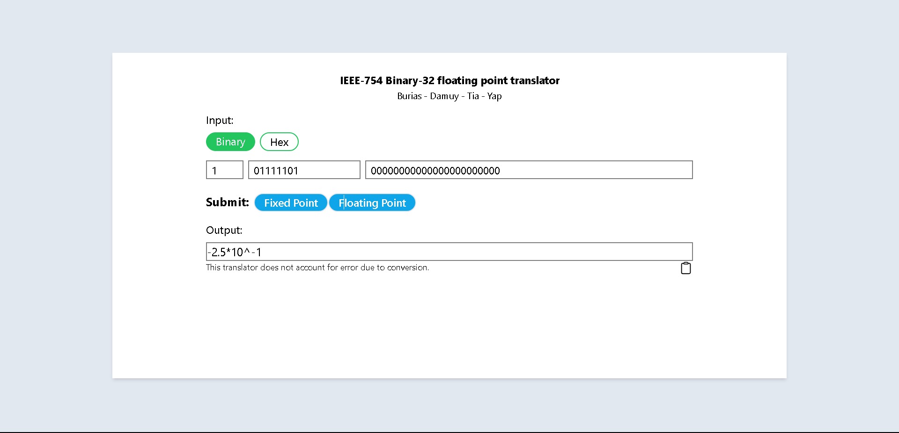
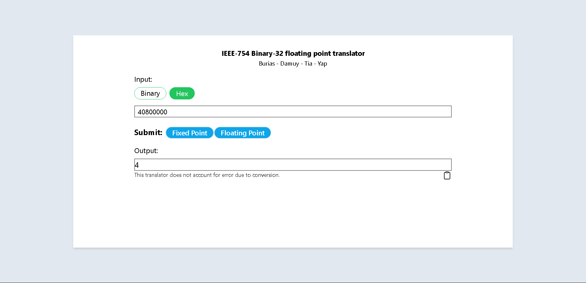
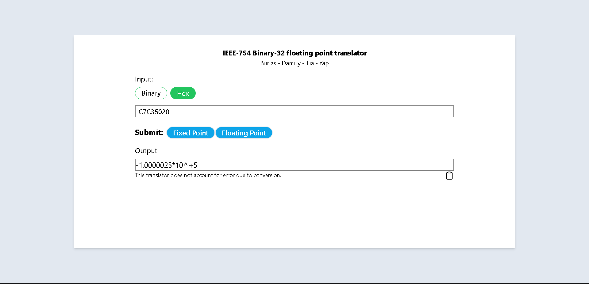
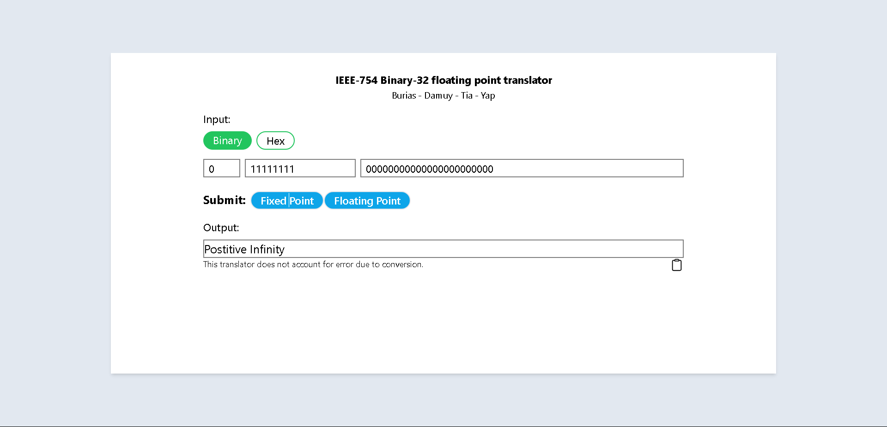
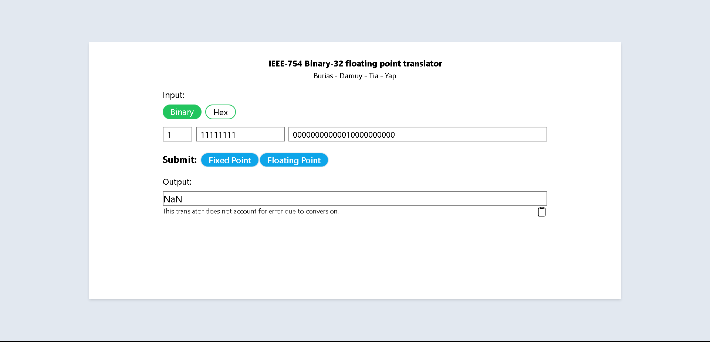
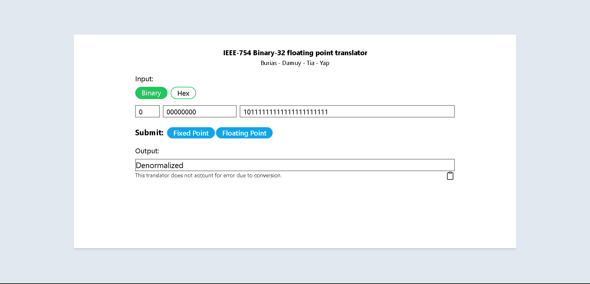

# IEEE-754 Binary-32 floating point translator 

Developed by: Derek Royce Burias, Khryssha Claire Damuy, Christian Tia, and Jan Benjamin Yap (CSARCH2 S12 Group 9)

This project takes an 8-digit hexadecimal or 32-bit binary input and converts it to its corresponding fixed or floating point decimal number. Special cases are included such as 0, -0, infinity, negative infinity, NaN, and denormalized inputs. This translator does not account for error due to conversion.

Test Cases:
- Binary to Fixed Point

- Binary to Floating Point

- Hexadecimal to Fixed Point

- Hexadecimal to Floating Point

- Positive 0

- Negative 0

- Positive Infinity

- Negative Infinity

- NaN (Not a Number)

- Denormalized


[Access the demonstration video here.](https://youtu.be/BXOSGPJJCwU)

Actual project can be accessed here [T3AY2324 Group 9 CSARCH2 Simulation Project](https://christianvtia.github.io/arch2-sp/).

To run the code locally:
- Have [Node.js](https://nodejs.org/en) installed
- Clone the repository
- Run ```npm i```
- Run ```npm run dev```
- Open in [localhost](http://localhost:5173/arch2-sp/)
